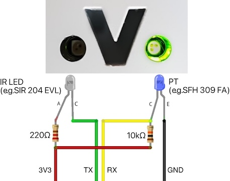

# Home-Assistant Optolink
Instructions to connect a Viessmann Optolink heating to Home-Assistant using a PoE powered WT32-ETH01 EVO board based on ESP32-C3

## Goals
- Get temperature and status information from a Viessmann heating with a "Vitotronic 200 KW1" controller
- Collect this information in Home-Assistant and e.g. trigger a push notification when the heating is in an error condition
- Integration to Home-Assistant via ESPHome as it's very convenient
- Ethernet connection because of bad wifi signal near the heating
- Ideally use PoE as there is no unused power outlet near my heating
- 3D printed case that perfectly fits the electronic and of course also fits to the Optolink connector of the heating

## Needed hardware
- WT32-ETH01 EVO (or ETH01 EVO) based on an ESP32-C3 board with additional PoE module (e.g. from [AliExpress](https://de.aliexpress.com/item/1005006520809270.html))

  

  

  Of course you can also use the ETH01-EVO without the PoE extension but then you need to power the module separately.
- Optolink circuit based on these [instructions](https://github.com/openv/openv/wiki/ESPHome-Optolink) with the following parts:
   - Photo transistor SFH-309 FA (e.g. from [Reichelt](https://www.reichelt.de/fototransistor-npn-730-1120nm-24-tht-3mm-sfh-309-fa-p60553.html))
   - Infrared led L-7104SF4BT KB (originally SIR-204 EVL which I couldn't get) (e.g. from [Reichelt](https://www.reichelt.de/infrarot-diode-gaalas-880-nm-50-3-mm-t1-l-7104sf4bt-kb-p216819.html))
   - Resistor 180Ω/220Ω (whatever you have) for the infrared led (e.g. from [Reichelt](https://www.reichelt.de/widerstand-kohleschicht-180-ohm-0207-250-mw-5--1-4w-180-p1362.html))
   - Resistor 10kΩ for the photo transistor (e.g. from [Reichelt](https://www.reichelt.de/widerstand-kohleschicht-10-kohm-0207-250-mw-5--1-4w-10k-p1338.html))
   - Some wires to connect the circuit together
   
   


    ATTENTION: The mentioned photo transistors and diodes have the anode on the longer leg and the cathode on the shorter leg with the flattened side of the led case except the L-7104SF4BT KB which doesn't have a flattened side.

- 3D printed case that fits the ETH01-EVO including PoE module, the photo transistor and the IR led.

  

  The design is based on the [WT32-ETH01 Enclosure](https://www.thingiverse.com/thing:5621092) from [ledhed_jgh](https://www.thingiverse.com/ledhed_jgh). 

  You can find the STL files for the case [here](files/ETH01-EVO-Optolink-Case.stl) and for the lid [here](files/ETH01-EVO-Optolink-Case-lid.stl). It prints very well with normal PLA but needs supports because of the "V" connector.

- Two countersunk screws M2x7 to hold the lid on the case

## Prerequisites
- A 3D printer to print the case
- Basic soldering skills
- Some electronic knowledge (plus, minus, anode, cathode, etc.)
- A Home-Assistant installation with the newest ESPHome (2024.10.2 as of writing)

## Hardware installation
- ***IMPORTANT***: Don't solder the pin headers that came with the ETH01-EVO yet as they have to be soldered differently than in the images from the sellers and the device has to be programmed first!
- Use a standard USB<->TTL converter (e.g. with FTDI232 or similar). Make sure that it can provide **3,3V and not 5V** and connect as follows (see also pinout above):
  | Converter | -> | ETH01-EVO | 
  |-|-|-|
  | RX | -> | TXD0 |
  | TX | -> | RXD0 |
  | 3V3 | -> | 3V3 |
  | GND | -> | GND |
  | open | -> | EN |
  | open | -> | IO09 |

  It's best to use some breadboard jumper wires that can just be connected without soldering. Use a rubber band to hold them in contact.

  

  To start the ETH01-EVO in boot mode it is necessary to connect "IO09" (yes, really - normally it's IO0 with ESP32s) with GND and then to reset the board shortly connect "EN" to GND for a quarter of a second. After programming you need to remove the connection from "IO09" to GND and do a reset manually again. 

  At this point you should skip over to the software installation part and install the device (with ethernet connected) in ESPHome to test if it is working at all. If that worked just go on here.

- Now that we know the module works we can solder the PoE module. Just disconnect all jumper wires and solder as in the image below:

  

  Only if it is soldered that way it will fit in the case later!

- Manufacture the "Optolink circuit" and connect as follows (cable colors used from circuit above):
  | Circuit | -> | ETH01-EVO | 
  |-|-|-|
  | RED | -> | 3V3 |
  | BLACK | -> | GND |
  | GREEN | -> | TXD (NOT TXD0!) |
  | YELLOW | -> | RXD (NOT RXD0!) |
  
  It is important to use the second hardware UART (IO05 RXD, IO02 TXD) for the circuit as there seems to be a problem in ESPHome using the default serial port with the strange connection parameters with two stop bits.

  To make the soldering easier you can 3D print the single [Optolink Adapter](files/Optolink-Adapter.stl) I used to test if everyting fits. Here you can solder all parts together and later just put in the real case as there isn't enough space to solder it right there.

  You can also use jumper wires here. Even with the soldered PoE module they will exactly fit in the 3D printed case later.

- Put everything in the 3D printed case. If the photo transistor or the IR led don't hold in place just use some hot glue from behind to fix them. Test everything before you close the lid and mount the screws.

## Software installation
- In ESPHome you can start with the following template:
```yaml
esphome:
  name: heating-optolink
  friendly_name: heating-optolink
  build_path: esp32
  platformio_options:
    upload_speed: 115200

esp32:
  board: esp32-c3-devkitm-1
  variant: esp32c3
  framework:
    type: esp-idf

external_components:
  - source:
      type: git
      url: https://github.com/JuergenLeber/esphome
      ref: dm9051
    components:
      - ethernet
    refresh: 0s
  - source: 
      type: git
      url: https://github.com/JuergenLeber/esphome_vitoconnect
      ref: master
    refresh: 0s
      
ethernet:
  type: DM9051
  clk_pin: GPIO07
  mosi_pin: GPIO10
  miso_pin: GPIO03
  cs_pin: GPIO09
  interrupt_pin: GPIO08
  reset_pin: GPIO06
  clock_speed: 8MHz  

logger:
  hardware_uart: UART0
  level: DEBUG

uart:
  - id: uart_vitoconnect
    rx_pin: GPIO05
    tx_pin: GPIO02
    baud_rate: 4800
    data_bits: 8
    parity: EVEN
    stop_bits: 2

vitoconnect:
  uart_id: uart_vitoconnect
  protocol: KW
  update_interval: 30s

sensor:
  - platform: vitoconnect
    name: "Außentemperatur"
    address: 0x0800
    length: 2
    unit_of_measurement: "°C"
    accuracy_decimals: 1
    filters:
      - multiply: 0.1
    device_class: temperature
  - platform: vitoconnect
    name: "Kesseltemperatur"
    address: 0x0802
    length: 2
    unit_of_measurement: "°C"
    accuracy_decimals: 1
    filters:
      - multiply: 0.1
    device_class: temperature
  - platform: vitoconnect
    name: "Speichertemperatur"
    address: 0x0804
    length: 2
    unit_of_measurement: "°C"
    accuracy_decimals: 1
    filters:
      - multiply: 0.1
    device_class: temperature
  - platform: vitoconnect
    name: "Rücklauftemperatur"
    address: 0x080A
    length: 2
    unit_of_measurement: "°C"
    accuracy_decimals: 1
    filters:
      - multiply: 0.1
    device_class: temperature
  - platform: vitoconnect
    name: "Vorlauftemperatur"
    address: 0x080C
    length: 2
    unit_of_measurement: "°C"
    accuracy_decimals: 1
    filters:
      - multiply: 0.1
    device_class: temperature
  - platform: vitoconnect
    name: "Vorlaufsolltemperatur"
    address: 0x2544
    length: 2
    unit_of_measurement: "°C"
    accuracy_decimals: 1
    filters:
      - multiply: 0.1
    device_class: temperature
  - platform: vitoconnect
    name: "Kesselsolltemperatur"
    address: 0x555A
    length: 2
    unit_of_measurement: "°C"
    accuracy_decimals: 1
    filters:
      - multiply: 0.1
    device_class: temperature
  - platform: vitoconnect
    name: "Brennerstarts"
    address: 0x088A
    length: 4
    unit_of_measurement: ""
  - platform: vitoconnect
    name: "Brennerbetriebsstunden Stufe 1"
    address: 0x08A7
    length: 4
    unit_of_measurement: "s"
    device_class: duration
  - platform: vitoconnect
    name: "Brennerbetriebsstunden Stufe 2"
    address: 0x08AB
    length: 4
    unit_of_measurement: "s"
    device_class: duration
  - platform: vitoconnect
    name: "Ölverbrauch"
    address: 0x7574
    length: 4
    unit_of_measurement: "l"
    accuracy_decimals: 3
    filters:
      - multiply: 0.001
    device_class: volume
  - platform: vitoconnect
    name: "Betriebsart"
    address: 0x2301
    length: 1
  - platform: vitoconnect
    name: "Heizkennlinie Niveau"
    address: 0x2304
    length: 1
  - platform: vitoconnect
    name: "Heizkennlinie Neigung"
    address: 0x2305
    length: 1
    accuracy_decimals: 1
    filters:
      - multiply: 0.1
  - platform: vitoconnect
    name: "Raumtemperatur Soll"
    address: 0x2306
    length: 1
    unit_of_measurement: "°C"
    accuracy_decimals: 1
    device_class: temperature

binary_sensor:
  - platform: vitoconnect
    name: "Störung"
    address: 0x0883
  - platform: vitoconnect
    name: "Heizkreispumpe"
    address: 0x250A
  - platform: vitoconnect
    name: "Warmwasserfreigabe"
    address: 0x2508

api:
  encryption:
    key: "<KEY>"

ota:
  - platform: esphome
    password: "<PASSWORD>"
```
  As the current ESPHome (2024.10.2 as of writing) doesn't support the ethernet chip on the ETH01-EVO yet this component has to be sourced from an external repository.

  Same for the [Vitoconnect component](https://github.com/dannerph/esphome_vitoconnect) which hasn't made it to the official repositories yet. It is currently linked to my fork as I repaired the KW protocol of the component. 

- For additional devices, values and other protocols (I only tested the KW protocol here) please see the documentation from the [openv](https://github.com/openv) project:
   - [Devices supported](https://github.com/openv/openv/wiki/Geräte)
   - [Addresses to read/write values](https://github.com/openv/openv/wiki/Adressen)
   - [Protocols](https://github.com/openv/openv/wiki/Protokolle)

## Finalization
- Finally you can mount the whole "thing" to your heating and connect to a PoE capable switch or router. Alternatively you can use a PoE injector (e.g. a cheap Ubiquiti POE-AF from [Amazon](https://www.amazon.de/AP-Acc-Ubiquiti-U-POE-AF-Injektor/dp/B07FB72GJ3)). Mounted to the heating it will look like this:

  

- In Home-Assistant the device will then display the configured values:
  
  

## Thank you!
You've made it to the end, hopefully you'll have fun rebuilding the whole thing. 
In case of any questions feel free to contact me!

